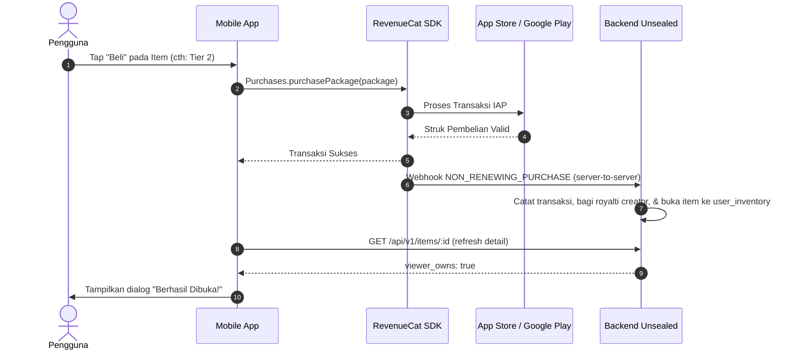

# Peny Store (Creator Marketplace) — Mobile API Contract & Integration Guide

Dokumen ini adalah **kontrak API resmi & panduan integrasi khusus untuk Mobile Apps (Android / iOS / Flutter)**. Dirancang agar mobile engineer dapat langsung mengonsumsi endpoint, menyusun UI etalase (dengan filter chip Prangko/Kertas/dll.), menampilkan profil kreator (Bottom Sheet MVP Fase 1 & Artist Page Fase 2), menangani transaksi IAP, dan menghubungkan aset yang dibeli ke Letter Composer.

---

## 1. Overview & Setup Autentikasi

### Base URL
- **Development**: `https://unsealed-be-development.up.railway.app`
- **Local**: `http://localhost:8080`

### Headers Wajib
Semua request dari aplikasi mobile wajib menyertakan Firebase Auth ID Token:
```http
Authorization: Bearer <firebase_id_token>
Content-Type: application/json
```

### Format Standar Envelope Response
```json
// Sukses (200 OK / 201 Created)
{
  "success": true,
  "data": { ... }
}

// Error (4xx / 5xx)
{
  "success": false,
  "error": "human-readable error description"
}
```

---

## 2. Desain Filter Bar & Chips di Mobile (Prangko, Kertas, Stiker, Amplop)

Pada halaman utama Store / Etalase, disarankan menyediakan baris Filter Chips horizontal di bawah Showcase Banner.

### Mapping UI Chip ke Query Parameter BE

| Label Chip UI | Query Param Backend | Keterangan |
|---|---|---|
| **Semua** | *(tanpa param)* atau `?category=all` | Mengambil seluruh katalog produk tanpa filter kategori |
| **Prangko** | `?category=stamp` atau `?category=stamp_pack` | Menampilkan seluruh paket prangko (*stamp packs*) |
| **Kertas** | `?category=paper` atau `?category=paper_pack` | Menampilkan seluruh paket kertas surat (*paper packs*) |
| **Stiker** | `?category=sticker` atau `?category=sticker_pack` | Menampilkan seluruh paket stiker (*sticker packs*) |
| **Amplop** | `?category=envelope` atau `?category=envelope_pack` | Menampilkan seluruh paket amplop (*envelope packs*) |
| **Paket / Bundle** | `?category=bundle` | Menampilkan paket bundle hemat (gabungan prangko, kertas, dll.) |

> [!TIP]
> **Pencarian Inklusif (`?type=...`)**:
> Jika pengguna memilih filter "Prangko" dan Anda ingin menampilkan **semua item yang memuat prangko** (termasuk paket bundle yang berisi prangko), gunakan param `?type=stamp` alih-alih `category=stamp`.
> - `?type=stamp` &rarr; item dengan `stamps_count > 0`
> - `?type=paper` &rarr; item dengan `papers_count > 0`
> - `?type=sticker` &rarr; item dengan `stickers_count > 0`
> - `?type=envelope` &rarr; item dengan `envelopes_count > 0`

---

## 3. Spesifikasi Endpoint Mobile

### 3.1 Showcase Banner (Promosi / Featured Carousel)
Mengambil daftar banner promosi teratas yang di-pin oleh admin untuk carousel header etalase.

- **Method**: `GET`
- **Path**: `/api/v1/shop/showcase`
- **Auth**: `Bearer <firebase_id_token>`

#### Response `200 OK`
```json
{
  "success": true,
  "data": {
    "items": [
      {
        "id": "e6a1e944-77a8-48b4-9271-e8d3568c8551",
        "title": "Autumn Botanical Collection",
        "sub_description": "Exclusive fall illustrations by Studio Kembara",
        "description": "A warm autumn pack featuring vintage botanical stamps and matching envelopes.",
        "showcase_banner_url": "https://pub-r2.penypost.me/banners/autumn_showcase.webp",
        "thumbnail_url": "https://pub-r2.penypost.me/thumbnails/autumn_thumb.webp",
        "tier": "tier_2",
        "category": "bundle",
        "creator_name": "Studio Kembara",
        "price_idr": 35000,
        "price_usd": 1.99
      }
    ]
  }
}
```

---

### 3.2 Katalog Etalase Produk (dengan Filter & Keyset Pagination)
Mengambil daftar item marketplace berstatus `PUBLISHED`.

- **Method**: `GET`
- **Path**: `/api/v1/items`
- **Auth**: `Bearer <firebase_id_token>`
- **Query Parameters**:
  - `category` *(optional)*: `stamp`, `paper`, `sticker`, `envelope`, `bundle`, atau `all`.
  - `type` *(optional)*: `stamp`, `paper`, `sticker`, `envelope` (filter berdasarkan aset yang terkandung di dalam item).
  - `creator_id` *(optional)*: UUID kreator. Digunakan saat membuka halaman *"More by this artist"*.
  - `after` *(optional)*: Cursor string dari `next_cursor` sebelumnya untuk infinite scroll.
  - `limit` *(optional, default: 20, max: 50)*: Jumlah item per fetch.

#### Contoh Request
```http
GET /api/v1/items?category=stamp&limit=20 HTTP/1.1
Authorization: Bearer <firebase_id_token>
```

#### Response `200 OK`
```json
{
  "success": true,
  "data": {
    "items": [
      {
        "id": "e6a1e944-77a8-48b4-9271-e8d3568c8551",
        "title": "Autumn Botanical Collection",
        "sub_description": "Exclusive fall illustrations",
        "thumbnail_url": "https://pub-r2.penypost.me/thumbnails/autumn_thumb.webp",
        "category": "bundle",
        "tier": "tier_2",
        "price_idr": 35000,
        "price_usd": 1.99,
        "creator_id": "c1f7a228-4f24-4f81-807d-cf5d50693a12",
        "creator_name": "Studio Kembara",
        "stamps_count": 4,
        "stickers_count": 8,
        "papers_count": 2,
        "envelopes_count": 1,
        "likes_count": 128,
        "viewer_has_liked": true,
        "created_at": "2026-09-25T07:00:00Z"
      }
    ],
    "next_cursor": "MjAyNi0wOS0yNVQwNzowMDowMFp8ZTZhMWU5NDQtNzdhOC00OGI0LTkyNzEtZThkMzU2OGM4NTUx"
  }
}
```
> **Catatan Pagination**: Jika `next_cursor == null`, user telah mencapai ujung katalog.

---

### 3.3 Detail Produk (Item Detail & Public Creator Card)
Menampilkan preview seluruh aset, harga, status like user, kepemilikan (`viewer_owns`), dan informasi profil kreator untuk Bottom Sheet MVP.

- **Method**: `GET`
- **Path**: `/api/v1/items/:id`
- **Auth**: `Bearer <firebase_id_token>`

#### Response `200 OK`
```json
{
  "success": true,
  "data": {
    "id": "e6a1e944-77a8-48b4-9271-e8d3568c8551",
    "creator_id": "c1f7a228-4f24-4f81-807d-cf5d50693a12",
    "creator_name": "Studio Kembara",
    "creator": {
      "id": "c1f7a228-4f24-4f81-807d-cf5d50693a12",
      "name": "Studio Kembara",
      "avatar_url": "https://pub-r2.penypost.me/avatars/kembara.webp",
      "bio": "Botanical illustrator & watercolor painter from Bandung.",
      "external_link": "https://instagram.com/studiokembara"
    },
    "category": "bundle",
    "tier": "tier_2",
    "price_idr": 35000,
    "price_usd": 1.99,
    "title": "Autumn Botanical Collection",
    "description": "Full collection containing 4 stamps, 8 stickers, 2 paper textures, and 1 custom envelope.",
    "sub_description": "Exclusive fall illustrations",
    "thumbnail_url": "https://pub-r2.penypost.me/thumbnails/autumn_thumb.webp",
    "showcase_banner_url": "https://pub-r2.penypost.me/banners/autumn_showcase.webp",
    "stamps_count": 4,
    "stickers_count": 8,
    "papers_count": 2,
    "envelopes_count": 1,
    "views_count": 1540,
    "likes_count": 128,
    "viewer_has_liked": true,
    "viewer_owns": false,
    "assets": [
      {
        "asset_type": "STAMP",
        "asset_url": "https://pub-r2.penypost.me/stamps/autumn_leaf.webp",
        "sort_order": 0
      },
      {
        "asset_type": "PAPER",
        "asset_url": "https://pub-r2.penypost.me/papers/kraft_vintage.webp",
        "sort_order": 1
      },
      {
        "asset_type": "STICKER",
        "asset_url": "https://pub-r2.penypost.me/stickers/mushroom.webp",
        "sort_order": 2
      },
      {
        "asset_type": "ENVELOPE",
        "asset_url": "https://pub-r2.penypost.me/envelopes/maple_wood.webp",
        "sort_order": 3
      }
    ],
    "created_at": "2026-09-25T07:00:00Z"
  }
}
```

---

### 3.4 Profil Publik Kreator (Fase 1 MVP & Fase 2 "More by this artist")
Jika user mengetuk nama atau avatar artis pada prangko atau surat, client dapat mengambil profil publik kreator:

- **Method**: `GET`
- **Path**: `/api/v1/creators/:id/profile`
- **Auth**: `Bearer <firebase_id_token>` (atau unauthenticated)

#### Response `200 OK`
```json
{
  "success": true,
  "data": {
    "id": "c1f7a228-4f24-4f81-807d-cf5d50693a12",
    "name": "Studio Kembara",
    "avatar_url": "https://pub-r2.penypost.me/avatars/kembara.webp",
    "bio": "Botanical illustrator & watercolor painter from Bandung.",
    "external_link": "https://instagram.com/studiokembara"
  }
}
```

> [!NOTE]
> **Alur UX Rekomendasi**:
> 1. **Fase 1 (MVP)**: Tampilkan Bottom Sheet dengan data `creator` (Avatar, Nama, Bio singkat, dan tombol "Kunjungi Profil" membuka `external_link`).
> 2. **Fase 2**: Di bagian bawah Bottom Sheet, sediakan tombol *"Karya Lainnya oleh Kreator Ini"* yang akan membuka layar katalog dengan query `GET /api/v1/items?creator_id=<id>`.

---

### 3.5 Interaksi Like (Toggle Like)
Menyukai atau membatalkan suka pada item.

- **Method**: `POST`
- **Path**: `/api/v1/items/:id/like`
- **Auth**: `Bearer <firebase_id_token>`

#### Response `200 OK`
```json
{
  "success": true,
  "data": {
    "has_liked": true,
    "likes_count": 129
  }
}
```
*Gunakan pendekatan Optimistic UI: langsung ubah icon hati & angka likes di UI, lalu rollback bila request gagal.*

---

### 3.6 Item View Counter (Non-blocking)
Panggil endpoint ini saat user membuka halaman detail produk lebih dari 1-2 detik. Backend memprosesnya secara asinkron tanpa memperlambat aplikasi.

- **Method**: `POST`
- **Path**: `/api/v1/items/:id/view`
- **Auth**: `Bearer <firebase_id_token>`

#### Response `200 OK`
```json
{
  "success": true,
  "data": {
    "status": "ok"
  }
}
```

---

### 3.7 Inventori Pengguna (Jembatan ke Letter Composer)
Mengambil semua item marketplace yang telah dimiliki pengguna beserta aset di dalamnya. Digunakan oleh layar Composer saat memilih prangko, kertas, atau amplop.

- **Method**: `GET`
- **Path**: `/api/v1/me/inventory`
- **Auth**: `Bearer <firebase_id_token>`

#### Response `200 OK`
```json
{
  "success": true,
  "data": {
    "items": [
      {
        "id": "e6a1e944-77a8-48b4-9271-e8d3568c8551",
        "title": "Autumn Botanical Collection",
        "thumbnail_url": "https://pub-r2.penypost.me/thumbnails/autumn_thumb.webp",
        "category": "bundle",
        "unlocked_via": "IAP",
        "unlocked_at": "2026-09-25T07:30:00Z",
        "assets": [
          {
            "asset_type": "STAMP",
            "asset_url": "https://pub-r2.penypost.me/stamps/autumn_leaf.webp",
            "sort_order": 0
          },
          {
            "asset_type": "PAPER",
            "asset_url": "https://pub-r2.penypost.me/papers/kraft_vintage.webp",
            "sort_order": 1
          }
        ]
      }
    ]
  }
}
```

---

## 4. Alur Pembelian In-App Purchase (RevenueCat)



### Identifier Produk In-App Purchase (IAP)
RevenueCat Product ID diformat standar berdasarkan Tier item:
- `peny_store_tier_1_item_<item_id>`
- `peny_store_tier_2_item_<item_id>`
- `peny_store_tier_3_item_<item_id>`
- `peny_store_tier_4_item_<item_id>`
- `peny_store_tier_5_item_<item_id>`

---

## 5. Referensi Model DTO Android (Kotlin)

Model data siap pakai menggunakan Moshi / KotlinX Serialization:

```kotlin
package app.unsealed.data.store.dto

import com.squareup.moshi.Json
import com.squareup.moshi.JsonClass

@JsonClass(generateAdapter = true)
data class BaseApiResponse<T>(
    @Json(name = "success") val success: Boolean,
    @Json(name = "data") val data: T?,
    @Json(name = "error") val error: String? = null
)

@JsonClass(generateAdapter = true)
data class ShowcaseResponseDto(
    @Json(name = "items") val items: List<ShowcaseItemDto> = emptyList()
)

@JsonClass(generateAdapter = true)
data class ShowcaseItemDto(
    @Json(name = "id") val id: String,
    @Json(name = "title") val title: String,
    @Json(name = "sub_description") val subDescription: String = "",
    @Json(name = "description") val description: String = "",
    @Json(name = "showcase_banner_url") val showcaseBannerUrl: String = "",
    @Json(name = "thumbnail_url") val thumbnailUrl: String = "",
    @Json(name = "tier") val tier: String,
    @Json(name = "category") val category: String,
    @Json(name = "creator_name") val creatorName: String = "",
    @Json(name = "price_idr") val priceIdr: Long = 0,
    @Json(name = "price_usd") val priceUsd: Double = 0.0
)

@JsonClass(generateAdapter = true)
data class CatalogResponseDto(
    @Json(name = "items") val items: List<CatalogItemDto> = emptyList(),
    @Json(name = "next_cursor") val nextCursor: String? = null
)

@JsonClass(generateAdapter = true)
data class CatalogItemDto(
    @Json(name = "id") val id: String,
    @Json(name = "title") val title: String,
    @Json(name = "sub_description") val subDescription: String = "",
    @Json(name = "thumbnail_url") val thumbnailUrl: String = "",
    @Json(name = "category") val category: String,
    @Json(name = "tier") val tier: String,
    @Json(name = "price_idr") val priceIdr: Long = 0,
    @Json(name = "price_usd") val priceUsd: Double = 0.0,
    @Json(name = "creator_id") val creatorId: String,
    @Json(name = "creator_name") val creatorName: String,
    @Json(name = "stamps_count") val stampsCount: Int = 0,
    @Json(name = "stickers_count") val stickersCount: Int = 0,
    @Json(name = "papers_count") val papersCount: Int = 0,
    @Json(name = "envelopes_count") val envelopesCount: Int = 0,
    @Json(name = "likes_count") val likesCount: Long = 0,
    @Json(name = "viewer_has_liked") val viewerHasLiked: Boolean = false,
    @Json(name = "created_at") val createdAt: String
)

@JsonClass(generateAdapter = true)
data class PublicCreatorDto(
    @Json(name = "id") val id: String,
    @Json(name = "name") val name: String,
    @Json(name = "avatar_url") val avatarUrl: String = "",
    @Json(name = "bio") val bio: String = "",
    @Json(name = "external_link") val externalLink: String = ""
)

@JsonClass(generateAdapter = true)
data class ItemAssetDto(
    @Json(name = "asset_type") val assetType: String, // "STAMP", "PAPER", "STICKER", "ENVELOPE"
    @Json(name = "asset_url") val assetUrl: String,
    @Json(name = "sort_order") val sortOrder: Int = 0
)

@JsonClass(generateAdapter = true)
data class ItemDetailDto(
    @Json(name = "id") val id: String,
    @Json(name = "creator_id") val creatorId: String,
    @Json(name = "creator_name") val creatorName: String,
    @Json(name = "creator") val creator: PublicCreatorDto,
    @Json(name = "category") val category: String,
    @Json(name = "tier") val tier: String,
    @Json(name = "price_idr") val priceIdr: Long = 0,
    @Json(name = "price_usd") val priceUsd: Double = 0.0,
    @Json(name = "title") val title: String,
    @Json(name = "description") val description: String = "",
    @Json(name = "sub_description") val subDescription: String = "",
    @Json(name = "thumbnail_url") val thumbnailUrl: String = "",
    @Json(name = "showcase_banner_url") val showcaseBannerUrl: String = "",
    @Json(name = "stamps_count") val stampsCount: Int = 0,
    @Json(name = "stickers_count") val stickersCount: Int = 0,
    @Json(name = "papers_count") val papersCount: Int = 0,
    @Json(name = "envelopes_count") val envelopesCount: Int = 0,
    @Json(name = "views_count") val viewsCount: Long = 0,
    @Json(name = "likes_count") val likesCount: Long = 0,
    @Json(name = "viewer_has_liked") val viewerHasLiked: Boolean = false,
    @Json(name = "viewer_owns") val viewerOwns: Boolean = false,
    @Json(name = "assets") val assets: List<ItemAssetDto> = emptyList(),
    @Json(name = "created_at") val createdAt: String
)

@JsonClass(generateAdapter = true)
data class LikeToggleDto(
    @Json(name = "has_liked") val hasLiked: Boolean,
    @Json(name = "likes_count") val likesCount: Long
)
```
